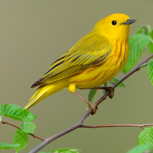
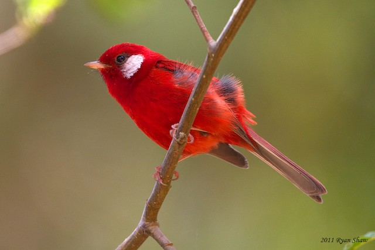

## **Landscape genomics of the red warbler (*Cardellina rubra*) in Mexican fragmented forests**

  In the last 50 years, Mexico lost about 50% of its forests because of land use change. Even though birds have been considered as highly tolerant to disturbed environments because of their ability to fly, recent analyses suggest that, this is not necessarily true. Next Generation Sequencing (NGS) is a sensitive tool that allows the detection of the effects of environmental changes on species at the population genetics level and enables inferences about connectivity, population sizes and adaptation.
 
In this repository, you will find the work generated to analyze Single Nucleotide Polymorphisms (SNPs) in two warblers species (*Vermivora chrysoptera, V. cyanoptera*) and a híbrid. Then, this will serve as the basis for analyze the impact of habitat fragmentation in genetic diversity, population structure and admixture of  *Cardellina rubra* along Trans-Mexican Volcanic Belt.

##### 
  
#### 
  

### **Data**
The SNPs dataset was download from **Data Dryad**: (https://doi.org/10.5061/dryad.kb610).  

### **Repository organization**

The repository will be organized in the following directories:
bin, data, graphics, meta, out.

**[bin](/bin)**

This folder will contain scripts to evaluate population structure, genetic diversity and admixture.

**[data](/data)**

This folder will contain a .vcf file with SNPs dataset and .str file for run fastStructure.

**[graphics](/graphics)**

This folder will contain figures and graphics related to the project.
Aditionally, .htlm files with figures and scripts development. 

**[meta](/meta)**

This folder will contain general information about samples (I.D, Geographical coordinates).

**[out](/out)**

Contains results of all analysis made in the research.

### Prerequisites

#### Software
* PGDSpider
* RStudio
* vcftools
* plink

#### R packages
- SNPRelate
- ggplot2
- gdsfmt

