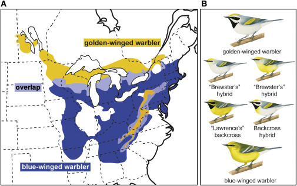

**Background**

***

In this repository, you found the work generated to analyze Single Nucleotide Polymorphisms (SNPs) in two warblers species *Vermivora chrysoptera and  V. cyanoptera*, two phenotypically divergent warblers that have a high rate of hibridization. 

##### 
  

##### **Figure 1.**  Geographic Variation across the Golden-Winged and Blue-Winged Warbler Complex

**Objective**
The principal aim for this proyect was  compare genome variation in golden-winged (Vermivora chrysoptera) and blue-winged (V. cyanoptera) warblers, which hybridize across a broad zone of eastern North America  

**Secondary objectives**
1. Explore data sets with Principal Components Analysis for see if exist any estructure for dataset.
2. Make genetic diversity analysis between species and hybrids.
3. Evaluate admixture between phenotypes 
4. Aditionally, the scripts generated for this proyect will serve as the basis for evaluate at genetic level to red warbler  (*Cardellina rubra*) an endemic species (with 3 subespecies) from Mexico as part of my doctoral project.

### **Data**
The SNPs dataset was download from **Data Dryad**: (https://doi.org/10.5061/dryad.kb610). The dataset contain 151 Individuals with genotype information generated from the ddRAD protocol, with individuals sampled across the range of both species. The original name dataset is GWWA_BWWA.GATK.filtered.removed.minGQ.20.removed.indv.max.missing.4.maf.02.vcf.recode.vcf and rename to data_warbler.vcf

The original paper: Toews, David P. L. et al. (2017) [Plumage genes and little else distinguish the genomes of hybridizing warblers.](https://www.cell.com/current-biology/fulltext/S0960-9822(16)30673-X?_returnURL=https%3A%2F%2Flinkinghub.elsevier.com%2Fretrieve%2Fpii%2FS096098221630673X%3Fshowall%3Dtrue)

### **Repository organization**

The repository be organized in the following directories:
bin, data, graphics, meta, out.

**[bin](/bin)**

This folder  contain scripts used for this project.

**Script list**
 - `1_exploratory analysis.R` Explore the SNP dataset with PCA analyses.
 - `2_genetic diversity.R` Script for evaluate genetic diversity (Observed heterozygosity, expected heterozygosity and inbreeding) for pupulations.
 - `3_Admixture.sh` make admixture analysis.
 - `4_candidate_loci.sh` search candidate loci using BayeScan softwares.

**[data](/data)**

This folder will contain a .vcf file with SNPs dataset and .str file for run fastStructure.

**[graphics](/graphics)**

This folder will contain figures and graphics related to the project.
Aditionally, .htlm files with figures and scripts development. 

**[meta](/meta)**

This folder contain a met_yw.csv file with information about samples: indiv (ID), site, coordinates, band number, sex.
The species name corresponds to the coarse scale phenotype, classified in the hand as either: BWWA - blue-winged warbler; GWWA - golden-winged warbler; BRWA - Brewster's warbler hybrid.

**[out](/out)**

Contains results of any analysis made in the research.
The results are divided into different folders for each analysis that correspond to each script.

**output list**
 - `1_exploratory analysis` output with PCA and exploratory analisis
 - `2_genetic diversity` output with dataframes of inbreeding, Observed heterozygosity and expected heterozygosity.
 - `3_Admixture` 
 - `4_candidate_loci` 

### Prerequisites
* R version 3.6.3 (2020-02-29)
* Platform: x86_64-pc-linux-gnu (64-bit)
* Running under: Ubuntu 18.04.5 LTS

#### Software
* PGDSpider 2.1.1.5
* RStudio  3.6.3
* vcftools 0.1.17
* plink 0.70
* ADMIXTURE 1.3.0
* BAYESCAN 2.1

#### R packages
- SNPRelate
- ggplot2
- gdsfmt

