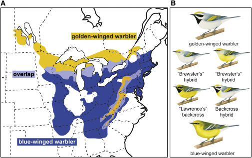
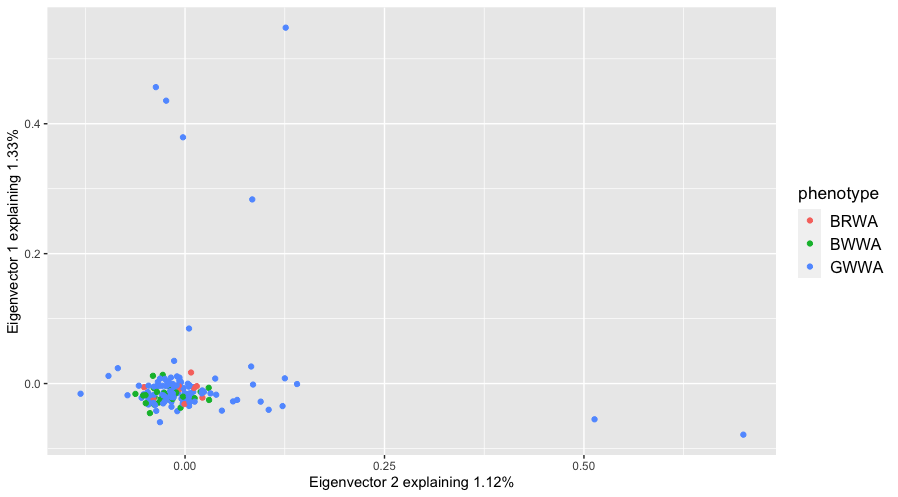
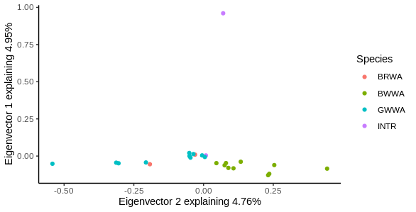

**Background**

***
The parulid warblers of North America are a well-known avian radiation in which species are distinguished by dramatic differences in plumage [2]. In Golden-winged and blue-winged warbler (two phenotypically divergent warblers), numerous studies have documented extensive hybridization [3] between them with little or no detectable fitness reduction in hybrid individuals[3]. However, both taxa are declining, and researchare focus of conservation efforts.

In this [**repository**:](https://github.com/VeronicaGlez/Red_warbler_repo) you found the work generated to analyze Single Nucleotide Polymorphisms (SNPs) in two warblers species *Vermivora chrysoptera and  V. cyanoptera*, two phenotypically divergent warblers that have a high rate of hibridization for explore populations structure and genetic diversity for both populations and their hybrids (Figure 1).

##### 
  

##### **Figure 1.**  Geographic Variation across the Golden-Winged and Blue-Winged Warbler Complex

**Objective**
The principal aim for this project was  compare genome variation in golden-winged (Vermivora chrysoptera) and blue-winged (V. cyanoptera) warblers, which hybridize across a broad zone of eastern North America  

**Secondary objectives**
1. Explore data sets with Principal Components Analysis(PCA) for see if exist any estructure for dataset.
2. Make genetic diversity analysis between species and hybrids.
3. Evaluate admixture between phenotypes 
4. Aditionally, the scripts generated for this proyect will serve as the basis for evaluate at genetic level to red warbler  (*Cardellina rubra*) an endemic species (with 3 subespecies) from Mexico as part of my doctoral project.

**Data**

The SNPs datasets was download from Data Dryad: (https://doi.org/10.5061/dryad.kb610).  See [datails from data sets and methods](https://github.com/VeronicaGlez/Red_warbler_repo).

**Results and discussion**

For the exploratory analyzes, I did not found a strong difference between the phenotypes of the species, (figure 2). It is possible that, given the high rate of hybridization, there is a large genetic flow between the populations, which would make it difficult to see any clear separation. The exploratory evaluations made with PCA does not show clearly groups between species or hybrids (Fig. 2).

##### 
  

##### **Figure 2.**  PCA by species complex. Phenotypes: BRWA - Brewster's warbler hybrid, BWWA - blue-winged warbler; GWWA - golden-winged warbler.

In the other hand, for evaluate the genetic diversity, the  populations show very similar values of heterozygosity observed and expected  but the golden-winged warbler show most inbreeding that the others phenotypes (Table 1). This decline is due in part to forest regeneration, which has reduced the availability of the early-successional habitats that both taxa rely on during breeding [4]. Golden-winged warblers are also thought to be threatened by displacement and hybridization due to expanding ranges of blue-winged warblers [5]: in many locations, golden-winged warblers have been replaced by hybrids and subsequently by blue-winged warblers [9].

| Ho     |      He  |   Fis  |        |
|--------|:--------:|------:|-------:|
| 0.1500 | 0.1693 | 0.04400 |"BRWA"  |
| 0.1698 |  0.1771| 0.0502  |"BWWA"  |
| 0.15633| 0.1721|**0.1261**| "GWWA" |

##### **Table 1.**  Genetic diversity of BRWA - Brewster’s warbler hybrid, BWWA - blue-winged warbler; GWWA - golden-winged warbler.

The evaluation of admixture analysis confirmed exploratory analysis with PCA  and not show any kind of structure between the populations k=1 with CV= 0.0376, see Table 2.

| K   |CV error |
|-----|:-------:|
|(K=1)| 0.37633 |
|(K=2)| 0.39824 |
|(K=3)| 0.41934 |
|(K=4)| 0.45215 |
|(K=5)| 0.47195 |
|(K=6)| 0.50126 |

##### **Table 2.**  Cross validation for k= 6 values, where the number in parentheses is the standard error of the cross-validation error estimate.

Finally, I made a new script for explore a resequencing datased with 11.4 million SNPs of the warblers complex. 
In this PCA analysis (Fig. 3), I  found a different pattern that first PCA and nearly 4.7% to the explain variance vs 1.7% that previous analysis. Maybe the diffence between populations are explain in particularmore variance explained and  
Possibly the differences between the phenotypes are found in particular regions of the genomes, which are not easily detected due to the high rate of hybridization, and only can detected with whole genome [4].
It would be important evaluate what regions they are and if they are coding for any gene or if exist snps  candidates under selection. 
 
  ##### 
  
  
  ##### **Figure 3.**  PCA by species complex. Phenotypes: BRWA - Brewster's warbler hybrid, BWWA - blue-winged warbler; GWWA - golden-winged warbler and INTR - intermediate hybrid.
  
  
  
### References 
 1. Lovette I.J; Bermingham E.
  Explosive speciation in the New World Dendroica warblers.
  Proc. Biol. Sci. 1999; 266: 1629-1636.
  
2. Vallender R; Robertson R.J; Friesen V.L; Lovette I.J.
Complex hybridization dynamics between golden-winged and blue-winged warblers (Vermivora chrysoptera and Vermivora pinus) revealed by AFLP, microsatellite, intron and mtDNA markers.
Mol. Ecol. 2007; 16: 2017-2029

3. Gill F.B. Blue-winged warblers (Vermivora pinus) versus golden-winged warblers (V. chrysoptera).
Auk. 2004; 121: 1014-1018

4. Toews, David & Taylor, Scott & Vallender, Rachel & Brelsford, Alan & Butcher, Bronwyn & Messer, Philipp & Lovette, Irby. (2016). Plumage Genes and Little Else Distinguish the Genomes of Hybridizing Warblers. Current biology : CB. 26. 10.1016/j.cub.2016.06.034.
